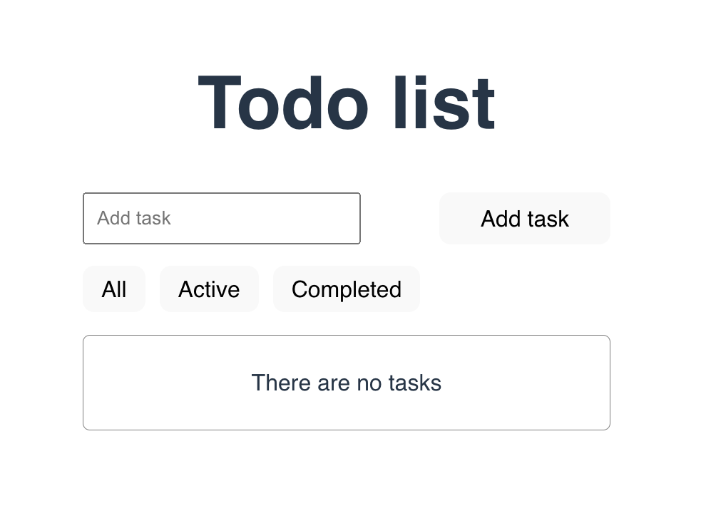

# Vue JS

*This is a repository with all my tutorials on Vue*

---

## *Todo App*

### /todo-app

>This is a small project built with Vue 3 and TypeScript.
>It demonstrates the basic concepts of Vue’s Composition API, including reactivity, event handling, and computed properties.
>The app allows users to add, complete, and delete tasks, and stores them persistently using the browser’s localStorage.
>Additionally, it features task filtering (All, Active, Completed), showing how to use reactive variables and conditional rendering in templates.
>The main goal of this project is to get familiar with Vue 3 and TypeScript integration, understand how state is managed with ref and computed, and how to work with lifecycle hooks like onMounted and watch.

*Libraries that are used in the project:*

```
"dependencies": {
    "vue": "^3.5.13"
  },
"devDependencies": {
    "@vitejs/plugin-vue": "^5.2.1",
    "@vue/tsconfig": "^0.7.0",
    "typescript": "~5.7.2",
    "vite": "^6.2.0",
    "vue-tsc": "^2.2.4"
  }
```

<a href="https://www.youtube.com">
    
</a>

---